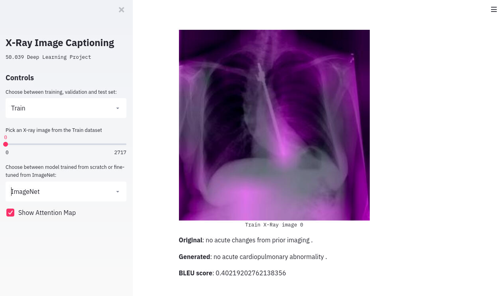

# Chest X-Ray Caption Generation

50.003 DL Project 2020

## Setup

Download necessary dataset and GloVe vectors from our provided S3 bucket (hosted until 1 June 2020)

```bash
wget https://deeplearning-mat.s3-ap-southeast-1.amazonaws.com/xray-dataset.zip
unzip xray-dataset.zip
wget https://deeplearning-mat.s3-ap-southeast-1.amazonaws.com/vectors.zip
unzip vectors.zip
```

Next, we need to install some required libraries.

1. We assume you already have PyTorch (we used 1.4) and torchvision installed
2. Install other packages with `pip install -r requirements.txt`
3. [Install Apex following the instructions here](https://github.com/NVIDIA/apex#quick-start)

## Run Demo GUI

```shell
streamlit run app.py
```



## Run Training Code

### Main Models

Training for CNN + LSTM character-level model, original image size

```shell
python3 exp_baseline_model.py
```

Training for CNN + LSTM + attention model word-level model, resized to 224x224

```shell
python3 exp_revised_model.py
```

### Other Models

Training for CNN + LSTM word-level model, beam search decoding, resized to 224x224

```shell
python3 exp_wordLevel_model.py
```

Training for CNN + LSTM word-level model, beam search decoding, use concat features and caption on the second dimension, resized to 224x224

```shell
python3 exp_wordLevel_model2.py
```

Training for CNN (lateral+frontal images) + LSTM word-level model, beam search decoding, use concat features and caption on the second dimension, resized to 224x224

```shell
python3 exp_wordLevel_model2_lateral.py
```

## Run Testing code
Simply add `--test` like this:
```shell
python3 exp_baseline_model.py --test
```

## Contributors

* Timothy Liu Kaihui (1002653)
* Hong Pengfei (1002949)
* Krishna Penukonda (1001781)

## Acknowledgement

Original data source Indiana University (IU) Chest X-Ray collection dataset, downloaded from [Kaggle](https://www.kaggle.com/raddar/chest-xrays-indiana-university/data#).
